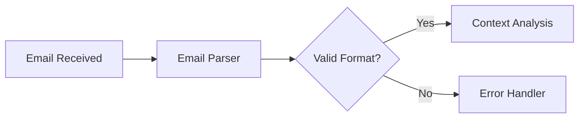
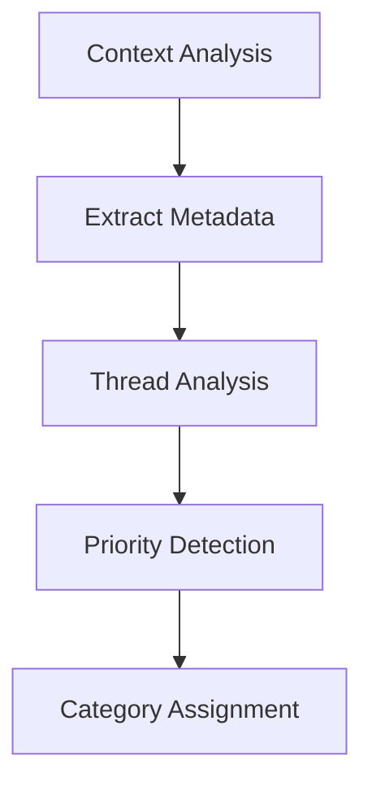
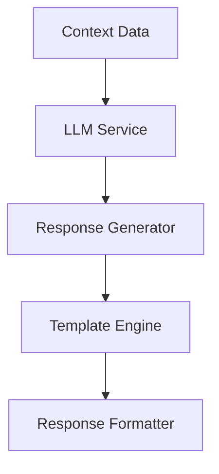
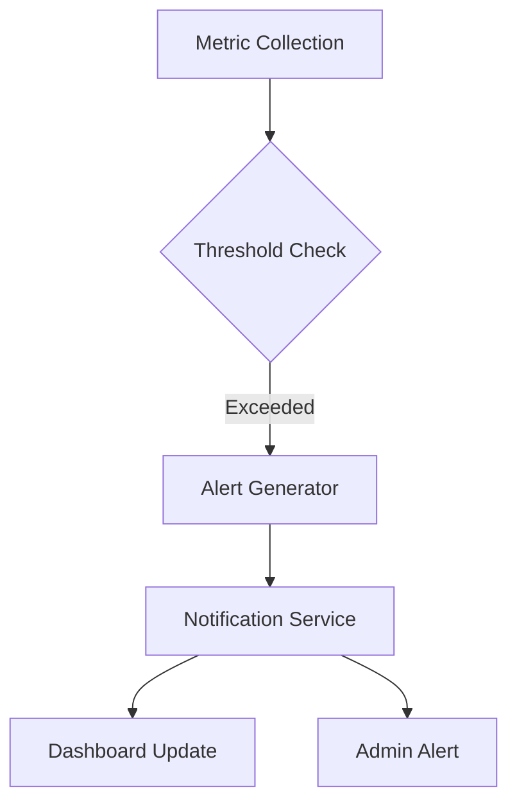
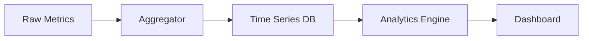
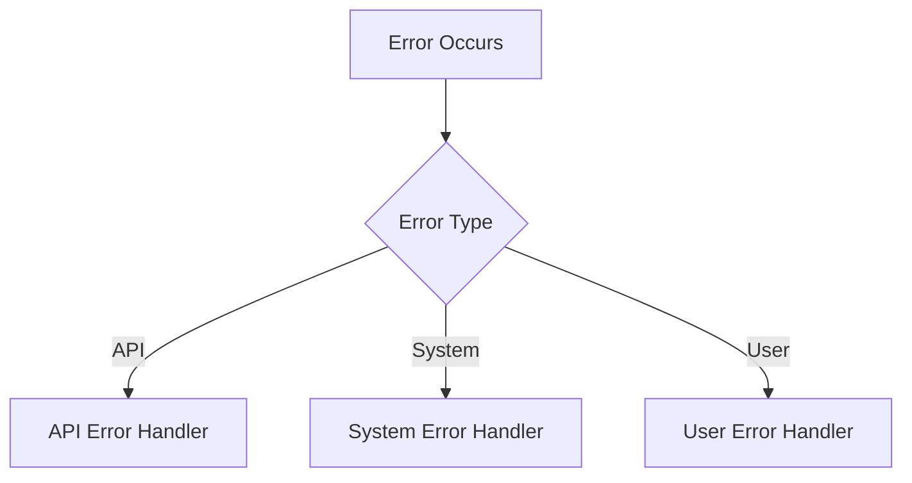
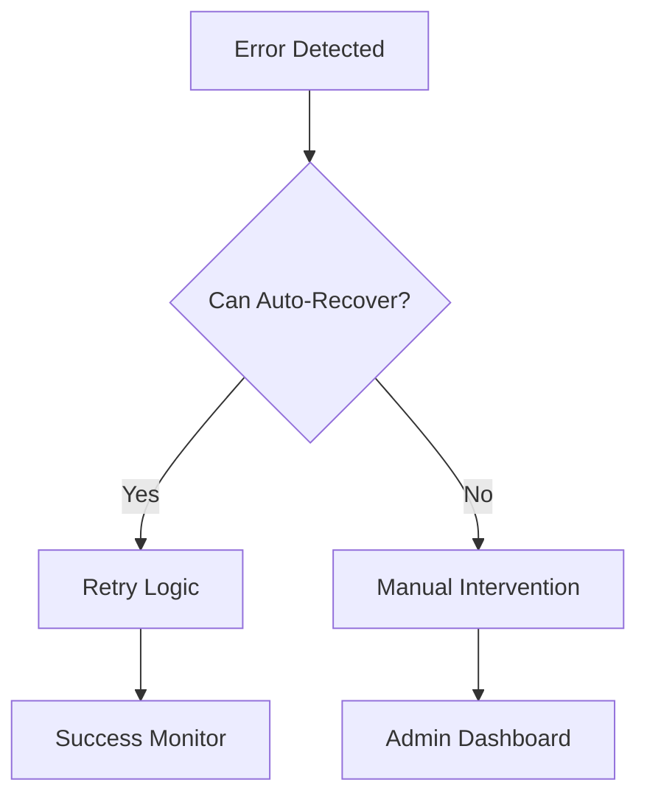
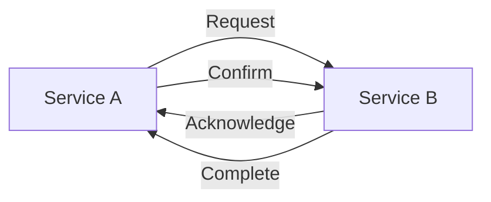
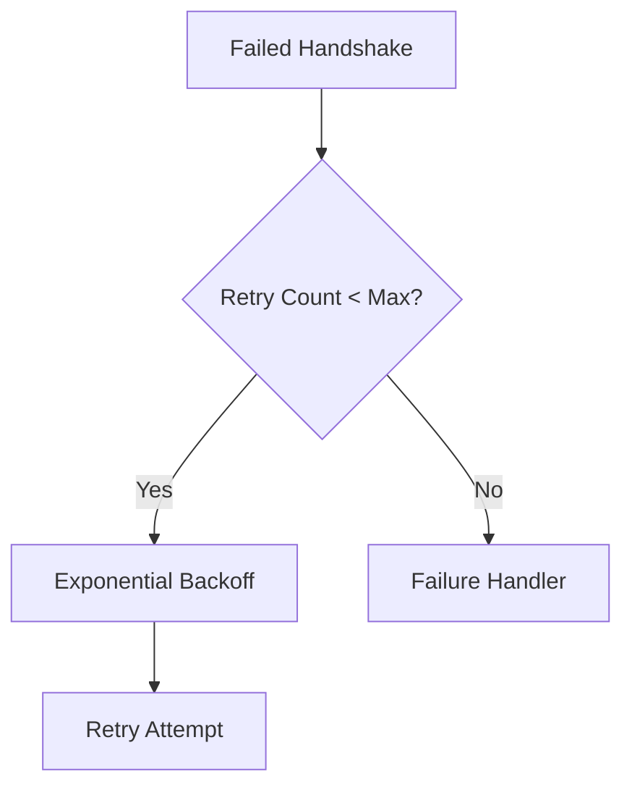

# Service Flow Documentation

## Email Processing Flow

### 1. Email Reception


### 2. Context Analysis


### 3. Response Generation


## Service Health Monitoring

### 1. Metrics Collection
- CPU Usage: Every 5 seconds
- Memory Usage: Every 5 seconds
- Active Connections: Real-time
- Request Rates: Per second aggregation

### 2. Health Checks
- Service Status: Every 10 seconds
- API Endpoints: Every 30 seconds
- Database Connection: Every minute
- Cache Status: Every 5 minutes

### 3. Alert System


## Performance Monitoring

### 1. Data Collection
```
- System Metrics
  └─ CPU, Memory, Disk
- Application Metrics
  └─ Response Times, Error Rates
- Service Metrics
  └─ Queue Length, Processing Time
```

### 2. Data Processing


### 3. Visualization Pipeline
```
Raw Data → Processing → Aggregation → Charting
```

## Error Handling Flow

### 1. Error Detection


### 2. Error Processing
```
1. Log Error
2. Classify Severity
3. Determine Impact
4. Generate Alert
5. Attempt Recovery
```

### 3. Recovery Flow


## Handshake Protocol

### 1. Service Communication


### 2. State Management
```
- Initiated
- Acknowledged
- Confirmed
- Completed
- Failed
```

### 3. Retry Mechanism
