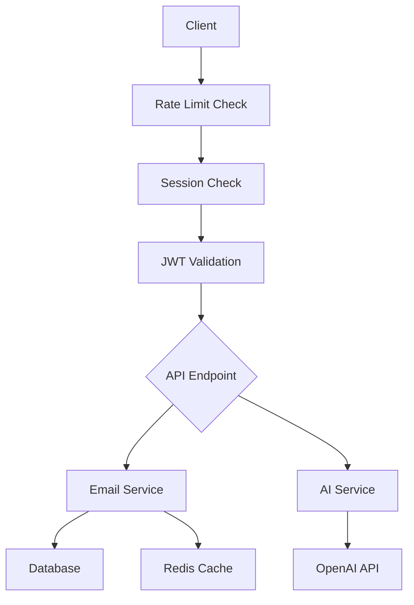
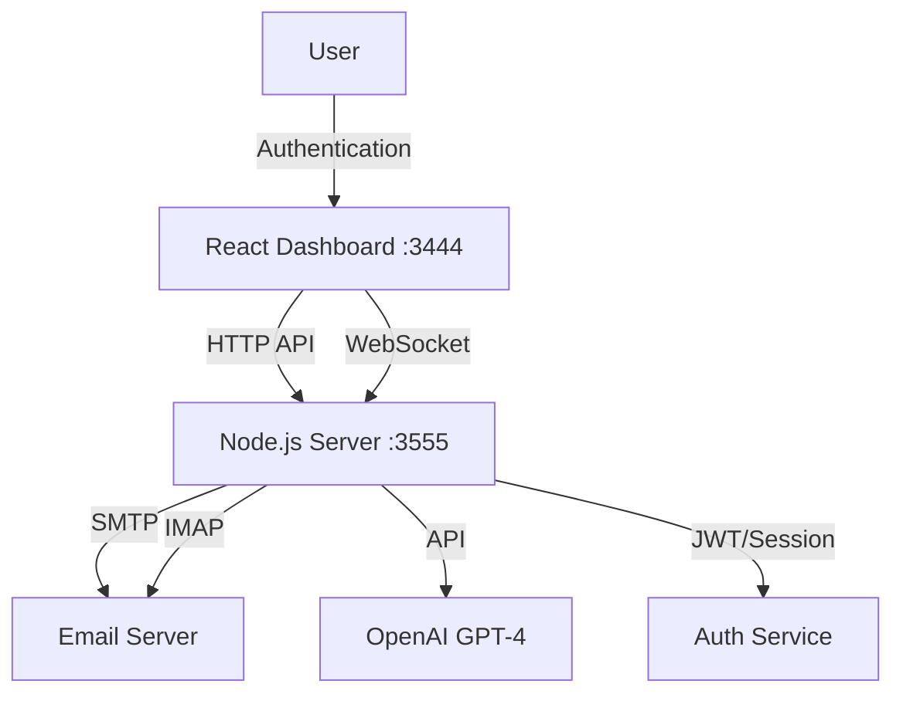

# Service Flow Documentation

## System Architecture
- Frontend: React.js application (Port 3002)
- Backend: FastAPI application (Port 8000)
- Database: PostgreSQL

## Current Status
1. Frontend Server
   - Status: Running
   - URL: http://localhost:3002
   - Stack: React, TypeScript
   
2. Backend Server
   - Status: Running
   - URL: http://localhost:8000
   - Stack: FastAPI, Python
   
## Development Progress
- [x] Frontend server initialized
- [x] Backend server initialized
- [x] Fixed TypeScript compilation errors
- [x] Configured proper ports
- [ ] Database connection
- [ ] API endpoints implementation
- [ ] Authentication system
- [ ] Email integration
- [ ] Testing suite

## Fixed Issues
1. Backend TypeScript compilation errors in AIController
2. Port conflict resolved by moving frontend to 3002
3. Backend server path corrected
4. Server startup commands fixed

## Next Steps
1. Set up and verify database connection
2. Implement remaining API endpoints
3. Add comprehensive error handling
4. Set up logging system
5. Configure environment variables

## Active Services
1. Frontend Development Server
   - Port: 3002
   - Hot Reload: Enabled
   - Status: Active

2. Backend Development Server
   - Port: 8000
   - Auto Reload: Enabled
   - Status: Active

## Known Issues
1. Backend server path needs verification
2. Environment variables need to be configured
3. Database connection needs to be established

## Security Considerations
- Implement proper CORS policies
- Set up rate limiting
- Add input validation
- Implement proper authentication
- Set up secure session management

## Authentication Flow
```mermaid
graph TD
    A[Client] --> B[/api/v1/auth/register]
    B --> C{Create User}
    C -->|Success| D[Send Verification Email]
    C -->|Failure| E[Return Error]
    A --> F[/api/v1/auth/login]
    F --> G{Authenticate}
    G -->|Success| H[Generate JWT Tokens]
    G -->|Failure| I[Return Error]
    H --> J[Create Session]
    J --> K[Return Tokens]
```

## Email Flow


## Service Dependencies
1. Core Services
   - AuthService
   - EmailService
   - UserService
   - SessionService

2. Infrastructure Services
   - PostgreSQL Database
   - Redis Cache
   - OpenAI Integration

3. Middleware Stack
   ```
   Client Request
   ↓
   CORS Middleware
   ↓
   Rate Limit Middleware
   ↓
   Session Middleware
   ↓
   Logging Middleware
   ↓
   Metrics Middleware
   ↓
   Application Logic
   ```

## Data Flow
1. Request Processing
   - Middleware validation
   - Authentication check
   - Rate limit verification
   - Session management

2. Business Logic
   - Service layer processing
   - Database operations
   - Cache management
   - External API calls

3. Response Handling
   - Data serialization
   - Error handling
   - Session updates
   - Response formatting

## Email Processing Workflow

### 1. Email Reception
- IMAP server monitors inbox for new emails
- New emails are detected and queued for processing
- Email metadata is extracted and stored
- Attachments are processed and stored securely

### 2. AI Analysis
- Email content is extracted and sanitized
- GPT-4 analyzes email content for:
  - Intent classification
  - Priority determination
  - Sentiment analysis
  - Key information extraction
- Analysis results are stored for reference

### 3. Response Generation
- AI generates appropriate response based on:
  - Email context
  - Previous communications
  - Custom templates
  - Business rules
- Response is formatted according to preferences
- Placeholders are replaced with actual data

### 4. Response Sending
- Generated response is validated
- SMTP server sends the response
- Delivery status is monitored
- Retry mechanism for failed attempts
- Success/failure is logged

### 5. Admin Summary
- Summary of processed email is generated
- Admin is notified of important actions
- Statistics are updated
- Logs are maintained for auditing

## Data Flow

### Frontend → Backend
1. User Authentication
   - Login credentials
   - JWT token management
   - Session handling

2. Configuration Updates
   - Email settings
   - AI preferences
   - Notification settings

3. Manual Actions
   - Manual email processing
   - Template management
   - Rule updates

### Backend → Frontend
1. Status Updates
   - Agent status
   - Processing status
   - Error notifications

2. Statistics
   - Email volume
   - Response times
   - Success rates
   - AI performance

3. Real-time Updates
   - WebSocket notifications
   - Live status changes
   - Important alerts

## Error Handling

### Email Processing Errors
1. Connection Issues
   - IMAP connection failures
   - SMTP sending failures
   - Retry mechanisms

2. AI Processing Errors
   - API rate limits
   - Model errors
   - Fallback mechanisms

3. Data Validation Errors
   - Email format issues
   - Content validation
   - Security checks

### Recovery Procedures
1. Automatic Retries
   - Exponential backoff
   - Maximum retry limits
   - Error logging

2. Manual Intervention
   - Admin notifications
   - Manual retry options
   - Error investigation tools

3. Fallback Mechanisms
   - Default templates
   - Offline processing
   - Manual processing queue

## Current Architecture [2024-02-03]



## Service Ports
- Dashboard UI: 3444
- Backend API: 3555
- Email Services:
  - SMTP: 587
  - IMAP: 993

## Communication Flow
1. User Interface (3444)
   - Serves React dashboard
   - Connects to backend API
   - Maintains WebSocket connection

2. Backend Server (3555)
   - Handles API requests
   - Manages WebSocket connections
   - Processes email operations
   - Integrates with OpenAI

3. Email Services
   - SMTP for sending emails
   - IMAP for receiving/syncing emails
   - Real-time email monitoring

4. AI Integration
   - OpenAI GPT-4 for email analysis
   - Real-time processing
   - Smart categorization

## Security Layer
- JWT for API authentication
- Session management
- CORS configuration
- Secure email connections
- Environment variable protection

## Monitoring Points
1. Port availability
2. Service connectivity
3. Email server status
4. AI service status
5. WebSocket connection health 